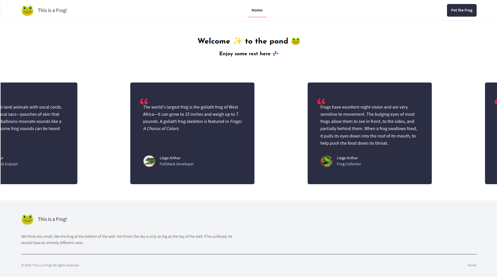
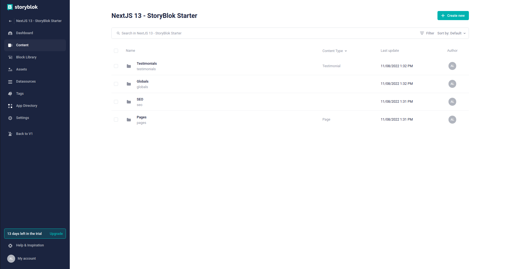
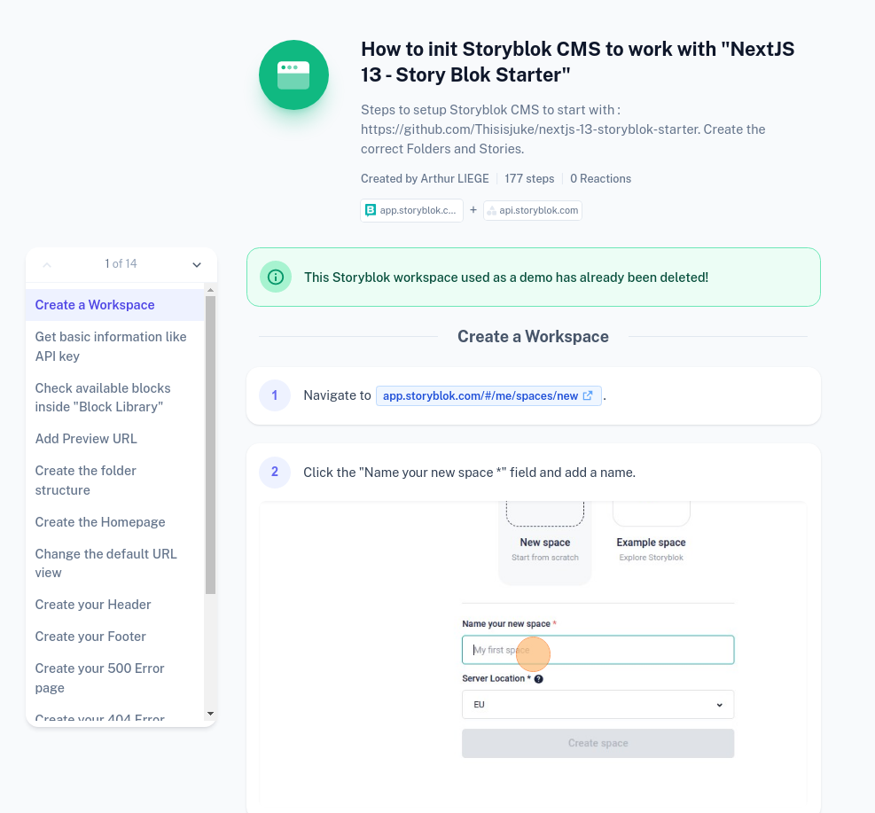

# NextJS 13 - Storyblok Starter

|        Front-end result        |         StoryBlok CMS View         |      Step by Step setup Tutorial      |
|:------------------------------:|:----------------------------------:|:-------------------------------------:|
|  |  |  |

**[NEW]** Here comes the [Step-by-Step setup Storyblok starter tutorial](https://scribehow.com/shared/How_to_init_Storyblok_CMS_to_work_with_NextJS_13__Story_Blok_Starter__YBPqInJ0QdSZ1-1GW-vNeg) 🤩✍️ !

Find a relative Medium blogpost here: https://medium.com/@liegearthur/nextjs-13-manage-your-content-using-storyblok-cms-a-clean-repository-starter-1362b9db303f

<!-- TOC -->
* [NextJS 13 - Storyblok Starter](#nextjs-13---storyblok-starter)
  * [What's inside the box ?](#whats-inside-the-box-)
  * [Command cheat sheet](#command-cheat-sheet)
  * [External dependencies](#external-dependencies)
  * [Getting started](#getting-started)
  * [How to set up things on your StoryBlok CMS ?](#how-to-set-up-things-on-your-storyblok-cms-)
  * [I am stuck in the code, can you help me ?](#i-am-stuck-in-the-code-can-you-help-me-)
  * [Environnement variable](#environnement-variable)
  * [Deploy](#deploy)
    * [Additional variables to add to your CI to deploy on Netlify (self-hosted Gitlab):](#additional-variables-to-add-to-your-ci-to-deploy-on-netlify--self-hosted-gitlab--)
  * [Resources](#resources)
<!-- TOC -->

> ⚠ Disclaimer :
> - This repository is an enhanced version of [Storyblok Official Tutorial : NextJS](https://www.storyblok.com/tp/add-a-headless-cms-to-next-js-in-5-minutes). 
> It's highly recommended to do this tutorial in another repo as a test, before starting with this repo.
> - This repository will not use `app` directory that enables [React Server Components](https://beta.nextjs.org/docs/routing/fundamentals). 
> It uses `pages` directory.
> - At the moment, we are not using the bridge given by `@storyblok/react` : it breaks in Production. 
> We are using this custom Bridge : [Bridge is not working in Production build](https://github.com/storyblok/storyblok-react/issues/113)

## What's inside the box ?

- Demo pages with `Header` / `Footer` / `HeadingBlok` / `TestimonialsSlider` / `SEO`, managed by Storyblok CMS.
- Storyblok setup with custom Bridge.
- `pages/[[...slug]].tsx` file that handles all pages of your application: all `Page` ressources in `Pages` directory on the CMS will generate a new NextJS page.
- Handle `404` and `500` errors with design coming from CMS, based on : [NextJS Doc - Handling Server Errors](https://nextjs.org/docs/advanced-features/error-handling#handling-server-errors).
- Auto generated `sitemap.xml` after each build.
- `.gitlab-ci.yml` to deploy your App + your Storybook on [Netlify](https://www.netlify.com/) from self-hosted Gitlab.
- TypeScript: CMS types are auto-generated, and used on `components/blocks/`. Components are typed.
- [TailwindCSS](https://tailwindcss.com/) basic setup.
- Simple atomic design inside `components/lib/` with few components based on TailwindUI.
- [Storybook](https://storybook.js.org/) setup with `next/image` and `next/router` mocks. All components have their own story.
- A Frog friendly interface 🐸

> ⚠ Many of things you will see in this repository are opinionated: feel free to change anything!

## Command cheat sheet

- `yarn dev`: Start the app on `localhost:3000` and the https proxy on `https://localhost:3010`.
- `yarn storybook`: Start storybook to see the stories of your components.
- `yarn build`: Build your application using default NextJS build.
- `yarn start`: Start the last build you have done (production mode).
- `yarn lint:fix`: Clean your code using `eslint`.
- `yarn storyblok-pull-components`: Update the local schema of your components: used to generate TypeScript types.
- `yarn storyblok-generate-types`: Generate TypeScript type

## External dependencies

Storyblok asks for a `https` certificat to ensure that the bridge can connect and that you can preview your website in Storyblok CMS.

You **NEED** to have **HTTPS Proxy Certificates** at the root of your project:
```
# HTTPS Proxy certificates
localhost.pem
localhost-key.pem
```

I used `mkcert` to generate my `.pem` files, following this tutorial (also working on Linux): [Setting up Dev Server with HTTPS Proxy On Windows](https://www.storyblok.com/faq/setup-dev-server-https-windows)

These are used inside `package.json` to start the dev on port `:3000` and an SSL proxy on port `:3010`.
```
"start-ssl": "local-ssl-proxy --source 3010 --target 3000 --cert localhost.pem --key localhost-key.pem",
```

> ⚠ Disclaimer : Here `local-ssl-proxy` is installed globally.

Feel free to replace `mkcert` and `local-ssl-proxy` by any package you want !

## Getting started

> ⚠ Your application will not start without a simple setup inside StoryBlok CMS. Check there how to do it: [Documentation : How to set up your StoryBlok CMS](./.doc).

Clone and fill `.env.local` file (see [Environnement variable](#environnement-variable) section):
```shell
cp .env.example .env.local
```
___
Install dependencies
```shell
yarn
```
___
Modify references to your Storyblok Workspace:

`package.json`:
```
"storyblok-pull-components": "storyblok pull-components --space=XXXXXX",
"storyblok-push-components": "storyblok push-components ./components.XXXXXX.json --space=XXXXXX",
"storyblok-generate-types": "storyblok-generate-ts source=./components.XXXXXX.json target=./types/storyblok-types",
```

And also these files name:
```
./components.XXXXXX.json
./presets.XXXXXX.json
```
___
Push the schemas for `Header` / `Footer` / `HeadingBlok` / `TestimonialsSlider` / `SEO` (it will ask for email/password):
```
storyblok-push-components
```

If you encounter an issue with your StoryBlok (like a timeout or a refused access), try this command:
```
npx storyblok logout
```
___
Now, you can start to modify things on StoryBlok CMS. Each time you want to regenerate the TypeScript to be in sync with your CMS, do:
```
yarn storyblok-pull-components
yarn storyblok-generate-types
```
___

> ⚠ Warning : Last recommendation to check [Storyblok Official Tutorial : NextJS](https://www.storyblok.com/tp/add-a-headless-cms-to-next-js-in-5-minutes).

## How to set up things on your StoryBlok CMS ?

There is a full illustrated tutorial here: [How to init Storyblok CMS to work with "NextJS 13 - Story Blok Starter"](https://scribehow.com/shared/How_to_init_Storyblok_CMS_to_work_with_NextJS_13__Story_Blok_Starter__YBPqInJ0QdSZ1-1GW-vNeg)

There is also a dedicated README.md that explains what you need to do on the CMS starting this point!

You can find it here: [Documentation : How to set up your StoryBlok CMS](./.doc/CMS-SETUP.md)

## I am stuck in the code, can you help me ?

There is a dedicated documentation TECH.md that explains some not obvious things about this repository (FAQ).

You can find it here: [Documentation : Hint and Tips about not obvious things](./.doc/TECH.md)

## Environnement variable

| Name                         | Description                                                                                                      | Example              |
|------------------------------|------------------------------------------------------------------------------------------------------------------|----------------------|
| REACT_STORYBLOK_ACCESS_TOKEN | API key from storyblok dashboard (Settings / Access Tokens).                                                     | b373-ed708fab45f4    |
| STORYBLOK_SECRET_TOKEN       | Your custom key used in `api/revalidate` to check if the webhook is coming from storyblok (Settings / Webhooks). | IZtrIZ3_D2bl1isr2gtt |
| ENV_BASE_URL                 | Domain name to generate the right `sitemap.xml`                                                                  | acme.com             |
| PREVIEW_SECRET_TOKEN         | Your custom key used in `api/preview` to check if user is authorized to preview.                                 | fd27e842-8e70        |

How to get your API key: [Create / Get an API key](./.doc/CMS-SETUP.md#get-an-api-key).

## Deploy

This repository can be easily deployed on [Vercel](https://vercel.com/) and [Netlify](https://www.netlify.com/) if you git repository is on GitHub or on the public Gitlab :
These 2 providers can be connected directly to your git repository: you will not need any configuration in `.gitlab-ci.yml`.

### Additional variables to add to your CI to deploy on Netlify (self-hosted Gitlab):

| Name                      | Description                                                                         | Example          |
|---------------------------|-------------------------------------------------------------------------------------|------------------|
| NETLIFY_AUTH_TOKEN        | Authentication token given on Netlify.                                              | 8fd27e8sr2gt1rIZ |
| NETLIFY_DEV_SITE_ID       | Site ID of your app (that you can find after creating a site inside Netlify).       | 0348535          |
| NETLIFY_STORYBOOK_SITE_ID | Site ID of your Storybook (that you can find after creating a site inside Netlify). | 0348535          |

## Resources
- Storyblok documentation: https://www.storyblok.com/docs/guide/getting-started
- Storyblok for NextJS: https://www.storyblok.com/tp/add-a-headless-cms-to-next-js-in-5-minutes
- Add an HTTPS Proxy : https://www.storyblok.com/faq/setup-dev-server-https-windows